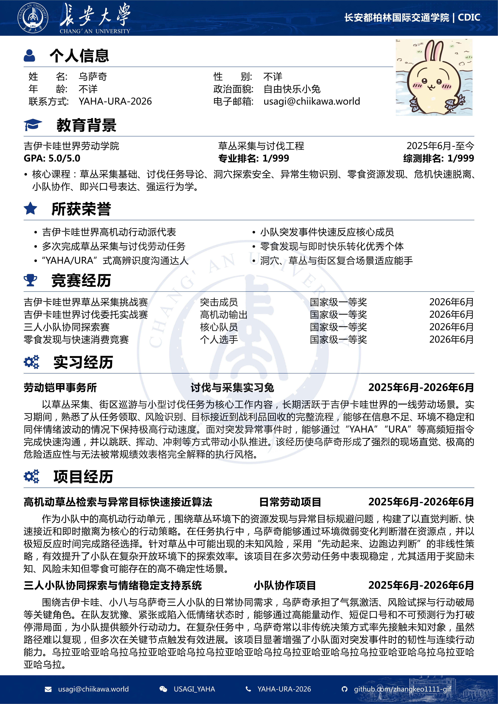
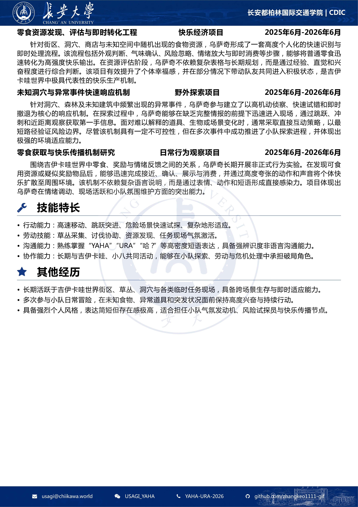

# 🚗 CV-for-CHUer

> 🎓 A LaTeX/XeLaTeX CV template for Chang’an University students/CHUers.  

> 专为长安大学学生/CHUer 打造的中文简历模板。

---

## ✨ 项目简介

本项目是一个专为 **长安大学学生 / CHUer** 制作的 **LaTeX/XeLaTeX 中文简历模板**，可用于 **保研、求职、实习申请、竞赛报名** 以及各类材料投递。**请使用XeLaTeX编译**。

模板设计主要参考了 **NPU-CV、NCU-CV** 以及一些经典中文简历模板，并在此基础上融入了长安大学风格的页眉页脚、蓝色学术化版式与模块化排版结构。模板支持以下常用简历模块：

- 👤 个人信息
- 🎓 教育背景
- 🏆 荣誉奖项
- 🚀 竞赛经历
- 🧩 实习经历
- 🔧 项目经历
- ⭐ 技能特长

仓库中提供了一个 **乌萨奇主题二创示例**，用更轻松的方式展示模板效果。从文字替换、头像修改，到 Logo、背景图、联系方式和模块内容调整，乌萨奇将手把手带大家做出一份 **精美、清晰、适合投递的中文简历 PDF**。

本模板仍在持续完善中。如果你在使用过程中遇到问题、排版错误或其他 bug，欢迎联系反馈，也欢迎提交 issue 或 PR 一起改进。

Fonts:字体；Images：素材图片；CHU_CV.tex:主体tex；zip：压缩包；pdf,png:模板实例
---

## 🌍 English Introduction

This is a **LaTeX/XeLaTeX Chinese CV template** specially designed for **Chang’an University students and CHUers**. It can be used for graduate program applications, job hunting, internship applications, competition registration, and various other submissions. **Please use XeLaTex**.

The template is mainly inspired by **NPU-CV, NCU-CV**, and several classic Chinese resume templates. Based on these references, it integrates Chang’an University-style header and footer designs, a blue academic visual layout, and a modular structure. It supports common CV sections such as personal information, education background, honors and awards, competition experience, internship experience, project experience, and skills.

This repository also provides a playful **Usagi-themed demo** to showcase the template in a more relaxed way. From replacing text and changing the avatar to customizing the logo, background images, contact information, and section contents, Usagi will guide users step by step to create a polished, clear, and submission-ready Chinese CV PDF.

This template is still under continuous improvement. If you encounter any problems, layout issues, or bugs during use, feel free to contact me, submit an issue, or open a pull request to help improve the project.

## Preview

  
  

项目地址/Project Address：https://github.com/zhangkeo1111-gif/CHU-CV

Overleaf: 可直接下载zip上传到overleaf使用，直接可以使用的模板还在审核

联系/contact: zhangkeo1111@gmail.com
